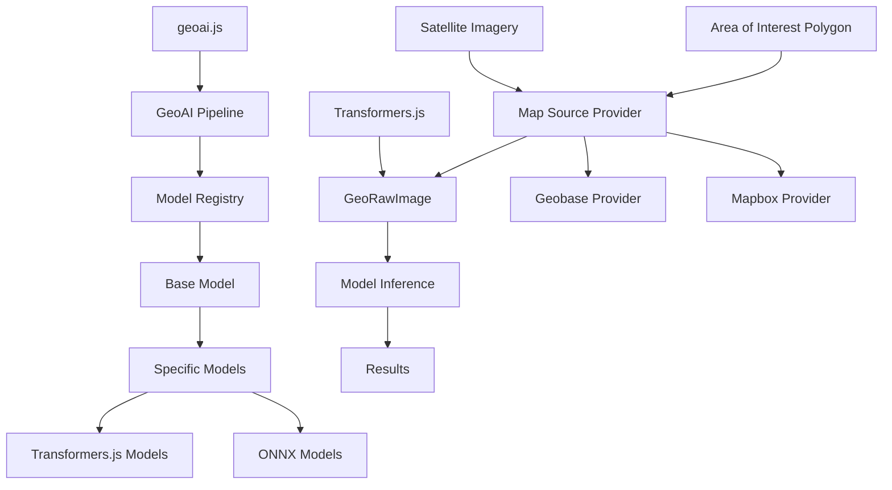
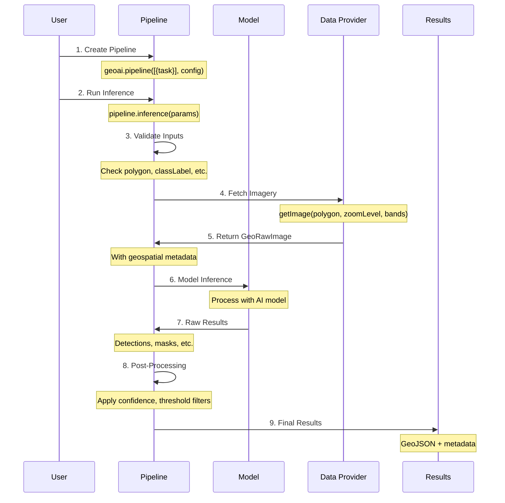

import { Callout } from "nextra/components";

# Core Concepts

> Understanding the fundamental building blocks of `geoai.js`

## Overview

`geoai.js` extends the Hugging Face Transformers.js library to provide geospatial AI capabilities. Here are the core concepts that make this possible:

## 1. Architecture

The overall architecture of `geoai.js` provides a modular framework for geospatial AI. The GeoAI Pipeline manages model execution, the Model Registry handles task configurations, and the Base Model provides the foundation for all AI models. This architecture enables extensible provider systems and supports both Transformers.js and ONNX models.

<Callout type="info">
  **Core Components:** Pipeline execution engine, extensible provider system, and modular model architecture supporting both Transformers.js and ONNX models.
</Callout>

## 2. [Transformers.js Extension](./concepts/GeoRawImage)

`geoai.js` extends the Hugging Face `RawImage` class with the `GeoRawImage` class to add georeferencing capabilities essential for geospatial AI tasks. This maintains spatial context by storing coordinate reference system (CRS) information and geographic bounds, enabling seamless conversion between pixel and world coordinates.

<Callout type="info">
  **Key Extension:** `GeoRawImage` extends `RawImage` with geospatial metadata including bounds, transform, and CRS information.
</Callout>

## 3. [Map Source Provider](../map-providers)

Map source providers abstract the process of fetching satellite imagery from different sources (Geobase, Mapbox, etc.). They handle tile-based image retrieval, coordinate transformations, and provide a unified interface for accessing geospatial imagery regardless of the underlying provider.

<Callout type="info">
  **Supported Providers:** Geobase (custom COG imagery), Mapbox (global satellite), with Google Maps and Esri ArcGIS coming soon.
</Callout>

## 4. [Model Pipeline](./concepts/model-pipeline)

The Model Pipeline is the core execution engine that enables both single task execution and task chaining. It manages model initialization, data flow between tasks, and provides a unified interface for running AI models on geospatial data.

<Callout type="info">
  **Two Patterns:** Single task execution for individual AI models, and task chaining for complex analysis workflows where output from one model becomes input to the next.
</Callout>

## 5. [Inference Parameters](./concepts/InferenceParams)

Inference parameters configure how AI models process geospatial data, including input specifications (polygons, class labels), post-processing options (confidence thresholds, filtering), and map source parameters (zoom levels, spectral bands).

<Callout type="info">
  **Required:** Geographic polygon defining the analysis area. **Optional:** Post-processing and map source parameters for fine-tuning model behavior.
</Callout>

## Getting Started

Choose a concept to dive deeper into the technical details, or explore the [quickstart guide](./) to see these concepts in action. 